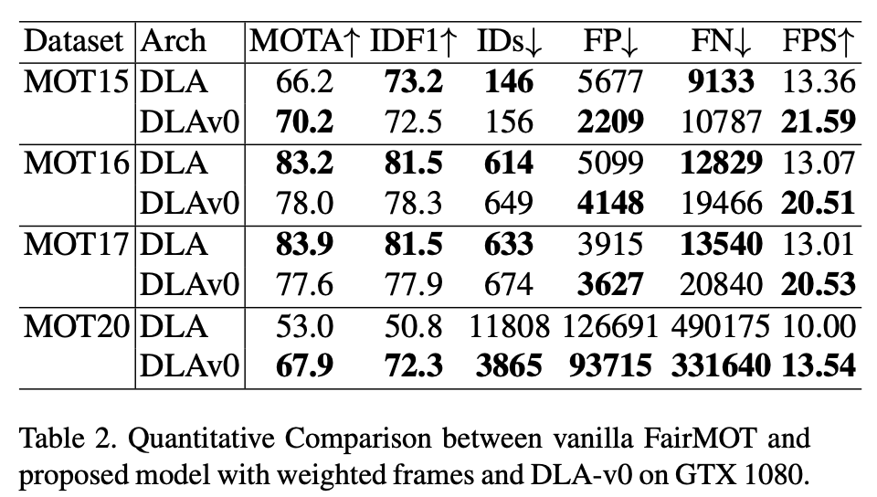

# atlas-track
Pedestrian Detection and Tracking on Atlas boards, dlav0 version of [FairMOT](https://github.com/ifzhang/FairMOT).

## Introduction
Multi Object Tracking (MOT) is a challenging topic as it often has two seperate tasks for detection and tracking. Recent attention focus on accomplishing the two tasks in a single network to improve the inference speed. [FairMOT](https://github.com/ifzhang/FairMOT), compared to [JDE](https://github.com/Zhongdao/Towards-Realtime-MOT), uses anchor-free CenterNet as the backbone to balance the detection and re-id branches and Kalman Filter for bounding box state prediction, resulting state-of-the-arts accuracy and near real-time speed (30 fps) using good GPUs. The dlav0 version has slightly lower accuracy but ~2x faster. The speed on Atlas 200DK is ~8 FPS depending on number of detections.

## Tracking performance
### Sample Comparison for Unseen Video
 
Or [Youtube](https://www.youtube.com/watch?v=ndSdGqUV0cg)

### Quantitative Comparison on GTX1080
 

### Important Notes
As the tracking/association part uses CPU and cannot be benefitted by HPU, the number of detection impacts the speed a lot.

## Installation
### Download Model
```
cd model
./download.sh
cd ..
```

### Install Dependencies
Python 3.6.9
```
pip3 install -r requirements.txt
```

### Run
```
python3 main.py --input_video "\Path to video"
```

### Acknowledgement
A large part of the code is borrowed from [FairMOT](https://github.com/ifzhang/FairMOT), [JDE](https://github.com/Zhongdao/Towards-Realtime-MOT), and [CenterNet](https://github.com/xingyizhou/CenterNet). Thanks for their wonderful works.